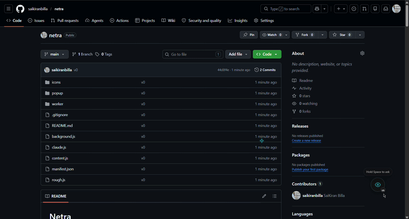

# Netra

A Chrome extension that puts an AI companion on every webpage. Hold Space, ask a question in natural language, and Netra responds with voice and visual guidance — flying a cursor to the exact element you need, drawing spatial highlights, and dimming the rest of the page with a cinematic spotlight.



---

## Features

- **Voice-first interaction** — hold Space to record, release to send. No buttons, no popups.
- **Visual guidance** — an animated cursor flies to the relevant element on the page. Rough.js draws hand-sketched circles, rectangles, and arrows directly on the page.
- **Cinematic spotlight** — the page dims and a glowing ring isolates the target element so your eye goes exactly where it should.
- **Claude Vision** — every query includes a screenshot of the current viewport so Claude can see what you see.
- **Natural voice responses** — ElevenLabs TTS reads the answer back. Falls back gracefully to showing text if TTS fails or times out.
- **Web search when needed** — fact-check and research queries are routed to a Cloudflare Worker that uses Exa to pull fresh sources. Navigation and UI questions go directly to the Claude streaming API for instant responses.
- **Conversation memory** — multi-turn context is maintained within a session so you can say "now click the next one" or "what about that other button".
- **Multi-language** — UI and voice recognition adapt to the page language (English, Hindi, Spanish, French, German, Japanese, Chinese, Arabic, Portuguese).
- **Private by default** — API keys are stored only in your local browser storage. Nothing is logged server-side unless you deploy your own worker.

---

## How it works

```
User holds Space
      │
      ▼
Web Speech API (in-browser STT)
      │
      ▼
Screenshot captured (JPEG, quality 85)
      │
      ▼
Intent detection (needsWebSearch)
      │
      ├── Navigation / UI question ──► Claude API (streaming)
      │
      └── Fact-check / research ──► Cloudflare Worker
                                          │
                                          ▼
                                    Claude + Exa tools
                                    (search, answer, contents,
                                     similar, research)
      │
      ▼
Response parsed for [POINT:...] and [DRAW:...] tags
      │
      ├── Cursor animation flies to element / coordinates
      ├── Spotlight dims page, glow ring pulses on target
      ├── Rough.js draws hand-sketched annotations
      └── ElevenLabs TTS speaks the answer
```

### Routing logic

Netra avoids unnecessary web searches to keep responses fast. Before sending a query to the worker, `needsWebSearch()` scans the transcript for signals like:

- `fact check`, `is this true`, `is this real`, `verify`
- `current price`, `latest news`, `today's`, `breaking news`
- `research`, `who is`, `what is the latest`
- `is this legitimate`, `is this a scam`, `check this`

Anything else — "where is the search bar?", "click the submit button", "what does this page say?" — goes straight to the Claude streaming API with no Exa involvement.

---

## Project structure

```
netra/
├── manifest.json          # MV3 manifest
├── background.js          # Service worker — message hub, screenshot capture, TTS port
├── content.js             # Content script — UI, voice, overlay, spotlight, cursor animation
├── claude.js              # Claude API client — streaming, intent routing, worker fallback
├── rough.js               # Rough.js library (hand-drawn SVG annotations)
├── popup/
│   ├── settings.html      # Settings page (API keys, worker URL)
│   ├── settings.css
│   └── voice.js
├── icons/
│   ├── icon16.png
│   ├── icon48.png
│   └── icon128.png
└── worker/                # Cloudflare Worker (optional server-side proxy)
    ├── wrangler.toml
    └── src/
        ├── index.ts       # Worker entry — Claude + Exa tool loop, POINT/DRAW tag parsing
        └── exa.ts         # Exa API functions (answer, search, contents, similar, research)
```

---

## Installation

### 1. Clone the repo

```bash
git clone https://github.com/your-username/netra.git
cd netra
```

### 2. Load the extension

1. Open Chrome and go to `chrome://extensions`
2. Enable **Developer mode** (toggle in the top-right)
3. Click **Load unpacked**
4. Select the `netra/` folder (the one containing `manifest.json`)

### 3. Add your API keys

Click the Netra icon in the toolbar (or go to `chrome://extensions` → Netra → Details → Extension options). A settings page opens where you can enter:

| Field | Required | Notes |
|-------|----------|-------|
| Anthropic API key | Yes | Powers all AI responses. Get one at [console.anthropic.com](https://console.anthropic.com). |
| ElevenLabs API key | No | Enables natural voice responses. Without it, answers appear as text only. |
| Cloudflare Worker URL | No | Keeps API keys off your device and enables Exa web search. See setup below. |

Keys are stored in `chrome.storage.local` — they never leave your device unless you configure the worker.

---

## Usage

| Action | What happens |
|--------|-------------|
| **Hold Space** | Starts listening (microphone activates) |
| **Release Space** | Stops recording and sends query |
| **Escape** | Dismisses the overlay and spotlight immediately |
| **Click toolbar icon** | Opens the settings page |

After you release Space, Netra will:
1. Capture a screenshot of the current tab
2. Send your question + screenshot to Claude
3. Animate a cursor to the relevant element
4. Dim the page and highlight the target with a glowing spotlight ring
5. Read the answer aloud (if ElevenLabs is configured)

The spotlight auto-hides 4 seconds after the response lands on screen. Press Escape at any time to clear everything.

---

## Cloudflare Worker (optional but recommended)

The worker serves two purposes:
1. **Keeps your Anthropic and ElevenLabs keys server-side** — the extension only needs the worker URL stored locally.
2. **Enables Exa web search** — for fact-checking and research queries, Claude runs a tool-use loop against the Exa API before composing a response.

### Deploy

```bash
cd worker
npm install
npx wrangler deploy
```

### Set secrets

```bash
npx wrangler secret put ANTHROPIC_API_KEY
npx wrangler secret put ELEVENLABS_API_KEY
npx wrangler secret put EXA_API_KEY
```

Get an Exa API key at [exa.ai](https://exa.ai).

### Configure the extension

Paste the deployed worker URL (e.g. `https://beacon-proxy.xyz.workers.dev`) into the **Cloudflare Worker URL** field in settings and click Save.

When a Worker URL is set and the query is detected as a search/research intent, the extension routes to the worker. All other queries still hit the Claude API directly from the extension for lowest latency.

---

## Architecture details

### content.js

The main content script injected into every page. Responsibilities:

- **Voice pipeline** — `MediaRecorder` + Web Speech API for STT; sends `sendToNetra` message to background on release
- **Overlay system** — `#beacon-overlay` (full-page SVG for Rough.js drawings) and `#netra-companion` (bubble UI)
- **Spotlight** — `#netra-spotlight` (CSS `mask` radial-gradient for page dim) + `#netra-glow-ring` (pulsing teal border); position animated via `requestAnimationFrame` with cubic easing over 600 ms
- **Cursor animation** — `flyToElement()` moves the fake cursor along a smooth arc using cubic-bezier interpolation and Rough.js landing circles
- **TTS** — tries `ttsFetchInContent()` (direct ElevenLabs fetch with 8 s `AbortController` timeout) first; falls back to `ttsFetchViaPort()` (via background service worker); on failure shows the full answer text in the bubble
- **Coordinate mapping** — `captureScale` and `modelXYToClient()` convert screenshot pixel coordinates from Claude into CSS pixel positions on the live page

### background.js

Service worker acting as the central message hub:

- `captureScreen` — `chrome.tabs.captureVisibleTab()` as JPEG quality 85; forwards screenshot to content.js and returns it to the caller
- `sendToNetra` — calls `askBeacon()` from `claude.js`; fans the response out to content.js (`beaconResponse`) and back to the popup
- `netraTts` port — fallback TTS path; fetches ElevenLabs as `ArrayBuffer` and transfers it over a `MessagePort` to avoid base64 overhead
- `storeSetting` / `getSetting` — thin wrappers around `chrome.storage.local`
- `ensureContentScript()` — pings content.js before every `sendMessage`; injects it programmatically if missing (handles tabs that were open before the extension loaded)

### claude.js

Claude API client running in the extension's isolated world:

- `askBeacon()` — top-level function; reads keys from storage, checks `needsWebSearch()`, routes accordingly, streams the response
- Streaming — uses the `anthropic-beta: interleaved-thinking-2025-05-14` header and processes `text_delta` events incrementally
- `askViaWorker()` — posts to the Cloudflare Worker `/chat` endpoint; re-throws network errors so `askBeacon()` can fall back to the direct API
- `needsWebSearch()` — keyword-based intent detector; returns `true` only for explicit search/fact-check signals
- Response parsing — same quote-aware `[POINT:...]` and `[DRAW:...]` regex as the worker to extract spatial annotations from the model output

### worker/src/index.ts

Cloudflare Worker entry point:

- `POST /chat` — accepts `{ transcript, language, screenshot, conversationHistory, screenMeta }`, runs a Claude tool-use loop with Exa tools, returns `{ text, points, draws }`
- Exa tools exposed to Claude: `exa_answer`, `exa_search`, `exa_contents`, `exa_similar`, `exa_research`
- Tool routing controlled by `TOOL USE — STRICT RULES` in the system prompt: Claude is instructed to only use Exa for explicit search signals, never for navigation or UI questions
- POINT/DRAW tags use quote-aware regex to handle CSS attribute selectors like `input[type="text"]`

### worker/src/exa.ts

Thin wrapper around the Exa API:

| Function | Exa endpoint | Use case |
|----------|-------------|---------|
| `exaAnswer` | `/search` | Quick factual answer with summary + highlights |
| `exaSearch` | `/search` | List of recent results with snippets |
| `exaContents` | `/contents` | Full text extraction from a specific URL |
| `exaSimilar` | `/findSimilar` | Pages similar to a given URL |
| `exaResearch` | `/search` | Deep research — 10 results with full text |

All search functions filter to the last 30 days by default (`startPublishedDate`) and cap at 3–10 results to keep token usage low.

---

## Permissions

| Permission | Reason |
|-----------|--------|
| `activeTab` | Read the active tab's URL for context |
| `scripting` | Inject content script into pre-existing tabs |
| `tabs` | Capture screenshots, open settings tab |
| `storage` | Persist API keys and settings locally |
| `<all_urls>` host permission | Content script runs on all pages |
| `https://api.elevenlabs.io/*` | Direct TTS fetch from content script |

---

## Privacy

- API keys are stored in `chrome.storage.local` (local to your browser profile, never synced).
- Screenshots are sent to the Claude API (or your self-hosted worker) only at query time and are not persisted.
- If you do not configure a Cloudflare Worker URL, all traffic goes directly from your browser to `api.anthropic.com` and `api.elevenlabs.io`.
- No analytics, no telemetry, no external calls beyond the APIs you explicitly configure.

---

## Development

The extension loads directly from the source folder — no build step required for the extension itself.

The worker uses TypeScript and must be compiled/deployed via Wrangler:

```bash
cd worker
npm install
npx wrangler dev          # local dev server
npx wrangler deploy       # deploy to Cloudflare
```

After any change to `claude.js`, `content.js`, or `background.js`, reload the extension at `chrome://extensions` (click the refresh icon on the Netra card).

---

## License

MIT
